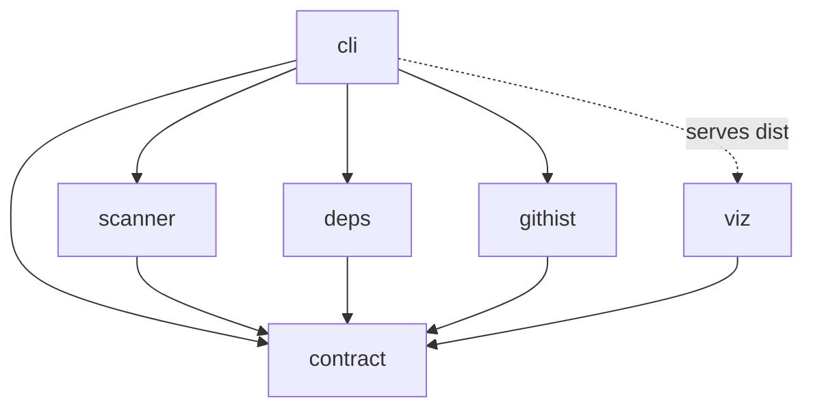
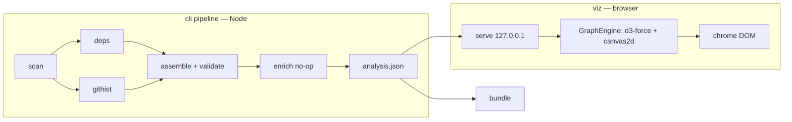

# Architecture Spine — gitnebula

## Design Paradigm

**Pipes-and-filters pipeline with a detached consumer.** The CLI orchestrates a
staged pipeline — `scan → (deps ∥ githist) → assemble+validate → emit` — whose
filters are pure async functions exchanging **values of contract types**. The
pipeline's product, `analysis.json`, is the only bridge to the detached
consumer (`viz`), which runs in a different environment (browser) and never
sees the pipeline. Map: one pnpm workspace package per brief-§9 module;
`@gitnebula/contract` is the hub every spoke depends on; `@gitnebula/cli` is
the only composer.

## Invariants & Rules

### AD-1 — The contract is the only inter-module interface [ADOPTED]

- **Binds:** all
- **Prevents:** hidden coupling that would break "viz builds against fixtures
  alone" and parallel implementation.
- **Rule:** modules exchange data exclusively as values of types exported by
  `@gitnebula/contract` — the `analysis.json` shape *and* the intermediate
  pipeline shapes (`ScanResult`, `DepsResult`, `GitResult`, resolved
  `Config`). No module imports another module's internals; no analyzer calls
  another analyzer. Module-level aggregation (edges, co-changes) happens
  *inside* deps/githist per ADR-0005 — cli's assemble stage only merges and
  validates.

### AD-2 — Dependency direction

- **Binds:** all packages
- **Prevents:** viz→analyzer edges (kills parallelism); analyzer↔analyzer
  edges (kills isolated testing); anything→cli (kills bundling).
- **Rule:** allowed package dependencies are exactly the edges in the diagram
  below, enforced physically: a package's `package.json` declares only its
  allowed edges, and every package declares an `exports` map so deep imports
  (`@gitnebula/contract/src/internal`) are impossible.



### AD-3 — Filter signature and purity

- **Binds:** scanner, deps, githist
- **Prevents:** analyzers with side doors (env/config/file reads) that make
  runs irreproducible and unit tests dishonest; a mid-story signature break
  when progress reporting is needed.
- **Rule:** each analyzer exports one entry:
  `analyze(input, config, onProgress?) → Promise<Result>` taking
  contract-typed values only; `onProgress(done, total)` is optional and
  fire-and-forget. Analyzers never read `.gitnebula.yml`, env vars, the clock,
  or the network; `githist` may spawn `git` (its declared side effect),
  `scanner` reads the tree, `deps` reads file contents. Config resolution
  happens once, in cli (precedence: defaults < `.gitnebula.yml` < CLI flags);
  default-exclude and layer-rule *data* are exported by scanner, *resolved*
  by cli.

### AD-4 — Determinism is a contract property

- **Binds:** scanner, deps, githist, cli, contract
- **Prevents:** unstable snapshots, meaningless CI diffs, PRD FR-7 violation.
- **Rule:** `Date.now()`/`Math.random()` are banned in analyzers (enforced via
  ESLint `no-restricted-globals`); cli injects `analyzedAt` and the
  `windowAnchor` (AD-13); every emitted list has a fixed stable sort (nodes by
  `id`; edges by `source,target`; cochanges by `count` desc, then ids); two
  runs on identical repo state + config (anchor included) are byte-identical
  except `analyzedAt`.

### AD-5 — Viewer split: GraphEngine / chrome

- **Binds:** viz
- **Prevents:** a canvas monolith; a false escape hatch — cosmos.gl is a
  layout-*plus*-render engine, so a render-only seam would make the swap a
  redesign instead of a replacement.
- **Rule:** viz separates the **GraphEngine** — layout *and* render behind one
  interface (`load(graph, seed)`, settle/unfold events, camera control,
  `pick`, mode/highlight state, `exportPNG`) — from **chrome** (DOM: panel,
  search, stats, legend, modes), which talks only to that interface and its
  events, never to the canvas or simulation state. MVP engine = d3-force +
  canvas 2D. Any replacement engine (cosmos.gl path) must re-satisfy AD-6
  seeding and the Settled semantics through the same interface. `exportPNG`
  re-renders through the same engine path at ≥ 2× density (never
  canvas-snapshot scaling).

### AD-6 — Seeded layout and the Settled definition

- **Binds:** viz
- **Prevents:** a different map on every reload; unreviewable README-map
  diffs; two agents inventing two "settled" tests. (Resolves PRD §8 Q6 and
  fixes the PRD's Settled constants.)
- **Rule:** all layout randomness flows from one PRNG seeded by
  `hash(repo.name)`, passed through the GraphEngine interface; the same
  `analysis.json` always settles into the same map. **Settled** = max node
  displacement < 0.5 px/frame for 30 consecutive frames — one tunable
  constant in viz, used by the FR-12 test, the replay control, and the
  reduced-motion path. `prefers-reduced-motion` skips animation, not
  determinism.

### AD-7 — Error policy: collect, don't abort; abort with shape

- **Binds:** scanner, deps, githist, cli
- **Prevents:** one unparsable file killing a 2,000-file run; unactionable
  failures.
- **Rule:** per-item failures (file parse, unresolved import, git rename
  miss) are collected as counted warnings surfaced in the terminal summary —
  never thrown. Stage-level failures abort with the fixed shape
  `«stage»: «cause» — «remedy»` and a non-zero exit. No silent drops: every
  drop increments a named counter.

### AD-8 — Offline by construction

- **Binds:** all
- **Prevents:** accidental network reach that breaks the local-first promise
  (PRD SM-3).
- **Rule:** the only permitted network operation in the entire system is the
  explicit `git clone` in cli URL-mode. Analyzers and viz contain no network
  imports; WASM grammars ship inside the package and load from a filesystem
  path; the served viewer and the bundle request only their own files; the
  server binds `127.0.0.1` exclusively.

### AD-9 — Schema is the source; types are generated

- **Binds:** contract
- **Prevents:** TS types and JSON Schema drifting into two truths.
- **Rule:** the JSON Schema (draft 2020-12, validated with ajv) is the
  normative contract; TS types are **generated** from it, committed, and
  CI-checked for freshness. `schemaVersion` follows semver-major discipline:
  any breaking change bumps major and is its own story + ADR (never a side
  effect). `@gitnebula/contract` exports the supported-major constant the
  Viewer checks (AD-12).

### AD-10 — The describe boundary is a named no-op with two sanctioned doors

- **Binds:** cli, contract, viz
- **Prevents:** MVP code growing tendrils the post-MVP LLM layer would have
  to cut through; and the inverse — an over-strict rule that outlaws two PRD
  requirements.
- **Rule:** the pipeline ends with `enrich(analysis) → analysis`, a named
  extension point that MVP implements as identity. `description`/
  `descriptionSource` stay `null`-valued, nullable, present. Exactly two
  other places may reference the describe concept: (1) the config schema
  knows the LLM key and cli prints the ignored-in-MVP notice (FR-4); (2) the
  panel component exposes an inert optional description slot (FR-19).
  Everything else is banned.

### AD-11 — Packaging: source-only internals, two build edges, one published artifact

- **Binds:** all packages
- **Prevents:** five agents choosing five module systems/build tools; an
  unpublishable CLI (`npx gitnebula` is the product's front door); build-order
  coupling between packages.
- **Rule:** pure ESM everywhere (`"type": "module"`, `moduleResolution:
  NodeNext`). `contract`, `scanner`, `deps`, `githist` are **source-only
  internal packages** (`exports` → `./src/index.ts`, no build step, no build
  ordering); vitest runs TS directly. Exactly two build edges exist: **viz**
  (Vite → one self-contained `index.html`, inlined JS/CSS, sibling
  `analysis.json`) and **cli** (tsup bundle inlining all workspace deps; its
  prepack copies the viz dist and the grammar `.wasm` into its assets). Only
  `gitnebula` (cli) is published; its semver is independent of
  `schemaVersion`. The `.wasm` is a deps asset resolved via
  `import.meta.url`, so the same code path works source-mode and bundled.

### AD-12 — The data-loading contract

- **Binds:** viz, cli
- **Prevents:** cli and viz agents agreeing on nothing more than "a JSON file
  exists somewhere" and integrating a 404.
- **Rule:** the Viewer fetches `./analysis.json` — a same-directory sibling
  URL — in **every** mode: Vite dev serves a chosen contract fixture at that
  URL; the cli server exposes the generated file at it; `gitnebula build`
  writes the sibling file (ADR-0004). On load, viz checks `schemaVersion`
  against the contract's supported-major constant and renders the FR-6 error
  screen on mismatch.

### AD-13 — History and universe semantics

- **Binds:** scanner, deps, githist, cli
- **Prevents:** churn counted on files the scanner excluded (silently
  disagreeing numbers); clock reads in analyzers; per-file `--follow`
  invocations detonating the 60 s budget; snapshot fixtures rotting on a
  timer.
- **Rule:** `ScanResult`'s node set is the **closed universe**: deps and
  githist drop (and count per AD-7) any path outside it. Exclusion globs are
  matched only in scanner, with picomatch. The resolved `Config` carries
  `windowAnchor` (ISO instant; cli injects run start; fixture tests pin it) —
  analyzers compute the window from it and never read the clock. Renames:
  one-pass `git log -M --name-status` over the window with an old→new path
  mapping; per-file `--follow` is banned.

### AD-14 — Fixture repos are built, not committed

- **Binds:** githist, scanner, cli, contract (test infra)
- **Prevents:** the nested-`.git` problem solved three incompatible ways;
  flaky CI checkouts.
- **Rule:** fixture repositories are produced by checked-in build scripts
  that replay crafted commits with pinned `GIT_AUTHOR_DATE`/
  `GIT_COMMITTER_DATE` and a fixed author/committer identity into a
  gitignored `test-fixtures/.generated/` — run by pretest and CI; commit
  hashes are deterministic. No `.git` directory (renamed or otherwise) is
  ever committed.

## Consistency Conventions

| Concern | Convention |
| --- | --- |
| Package names | `@gitnebula/<module>` (contract, scanner, deps, githist, viz, cli); only `gitnebula` (the cli package) is published |
| Files / symbols | kebab-case files, `camelCase` values, `PascalCase` types; no default exports |
| Node ids | repo-relative POSIX path; modules carry a trailing slash (`core/`), files don't (`core/scoring.py`) [ADOPTED from brief/mockup] |
| Dates | ISO-8601 UTC strings everywhere (`analyzedAt`, `lastChangedAt`, `windowAnchor`) |
| Error shape | `«stage»: «cause» — «remedy»` (AD-7); warnings are `{ stage, code, path?, detail }` |
| Tests | vitest, colocated `*.test.ts`; snapshot tests only against fixtures built per AD-14; per-story test command `pnpm --filter @gitnebula/<module> test` |
| Cross-env code | `contract` is environment-neutral (no `node:` imports, no DOM); viz is browser-only (DOM lib, no `node:`); scanner/deps/githist/cli are Node-only |
| Lint / format | ESLint 9 (flat) + Prettier defaults, root-configured; AD-4's bans are lint rules, not review notes |
| Terminal progress | stage start/end lines always; within-stage counts via AD-3's `onProgress` where a story needs them |
| Commits / process | Conventional Commits with scope = module, trailers per CLAUDE.md [ADOPTED] |

## Stack

| Name | Version |
| --- | --- |
| Node.js (floor) | ≥ 20 |
| TypeScript | 5.x |
| pnpm (workspaces) | 10.x |
| Vite (viz build) | 8.x |
| vitest | 4.x |
| d3-force | 3.x |
| TypeScript compiler API (deps: TS/JS resolution) | = project TS |
| web-tree-sitter | 0.26.x |
| tree-sitter-python (grammar source) | 0.25.x |
| tree-sitter-cli (grammar build, dev-only) | 0.26.x — **pinned to web-tree-sitter's WASM ABI** (see tree-sitter#5171); grammar built in-repo, `.wasm` committed as a deps asset |
| tsup (cli bundle) | current |
| ajv (schema validation) | 8.x |
| picomatch (exclusion globs) | current |
| commander (cli args) | current |
| yaml (config parse) | current |
| open (browser launch) | current |
| node:http (local server) | stdlib — no server framework |
| ESLint 9 + Prettier (dev) | current |
| Playwright (perf harness, dev-only) | current |

Minor-version pins happen at each package's first story; majors above are
verified current as of 2026-08.

## Structural Seed

```text
gitnebula/
  packages/
    contract/      # JSON Schema (source of truth), generated TS types, ajv validator, fixtures/
    scanner/       # tree walk, LOC, language, layer rule table (data), module derivation
    deps/          # import parsing: TS compiler API + web-tree-sitter; assets/tree-sitter-python.wasm
    githist/       # git log parsing: commits, churn, authors, co-change, rename mapping
    viz/           # Vite app: engine/ (GraphEngine: layout+render) chrome/ (DOM)
    cli/           # published as "gitnebula": orchestration, config, server, build, enrich no-op
  docs/            # brief, planning-artifacts/, implementation-artifacts/, adr/
  reference/       # mockup.html (behavioural reference)
  test-fixtures/   # fixture-repo build scripts (AD-14); .generated/ is gitignored
```



## Capability → Architecture Map

| Capability / Area | Lives in | Governed by |
| --- | --- | --- |
| FR-1..5 (launch, URL, progress, config, server) | cli | AD-3, AD-7, AD-8, AD-11 |
| FR-6..8 (contract, fixtures, describe hook, version refusal) | contract, cli, viz | AD-1, AD-9, AD-10, AD-12 |
| FR-9 (scan, layers, modules) | scanner | AD-3, AD-4, AD-13 |
| FR-10 (history metrics) | githist | AD-3, AD-4, AD-13, AD-14 |
| FR-11 (import edges) | deps | AD-3, AD-4, AD-13 |
| FR-12..18 (map, navigation, search) | viz | AD-5, AD-6, AD-12 |
| FR-19..22 (panel, modes, PNG) | viz | AD-5, AD-10 |
| FR-23..24 (bundle, CI recipe) | cli, viz | AD-8, AD-11, AD-12 |
| FR-25 (repo quality) | repo root, CI | conventions |

## Deferred

- **Layer rule table contents & default-exclude list** — data, not
  architecture (home: scanner exports the data, cli resolves — AD-3); tuned
  against demo repos in the scanner stories (ADR-0002).
- **Module-descent thresholds** (80% / depth 2) — validated in scanner
  stories against demo repos.
- **Co-change caps vs ≤ 5 MB budget** — validated in githist stories
  (ADR-0005 fixes the mechanism, numbers tunable).
- **Perf spike outcome** (Barnes–Hut + viewport unfold on the 2,000-node
  fixture) — a dedicated early story; a failed spike swaps the GraphEngine
  implementation (AD-5 fixes the seam so that swap stays a replacement, not a
  redesign).
- **Fuzzy-search scorer** — own subsequence scorer assumed; a story may adopt
  a micro-dep if quality demands.
- **Default port / port-scan strategy** — cli story detail.
- **describe backends** (Claude Code headless / BYOK / Ollama) — post-MVP by
  PRD non-goal; only AD-10's hook exists now.
- **Operational envelope** — deliberately thin: no deploy targets beyond the
  GitHub Pages static bundle (ADR-0004), no server ops (no backend, product
  principle 5); CI = GitHub Actions running lint + tests + the FR-24 recipe;
  npm publishing is manual by the maintainer (AD-11 fixes the artifact, not a
  release cadence).
